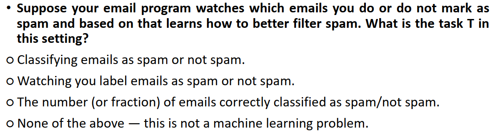
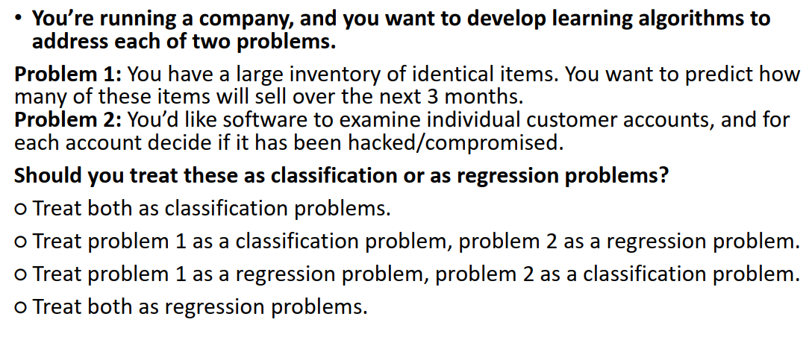
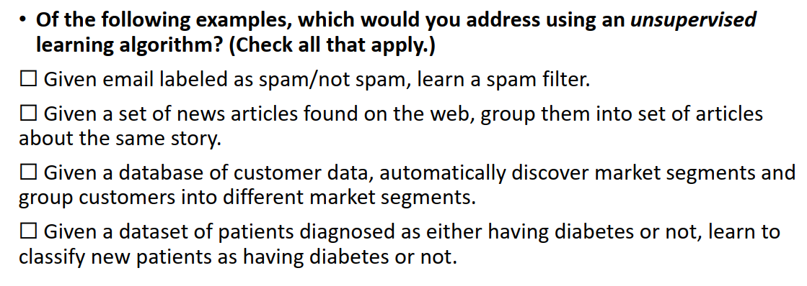
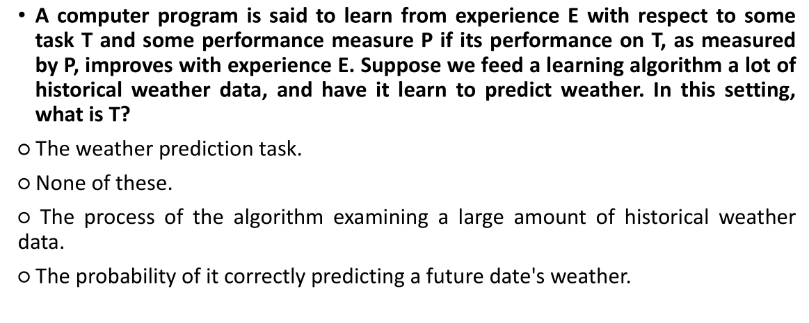
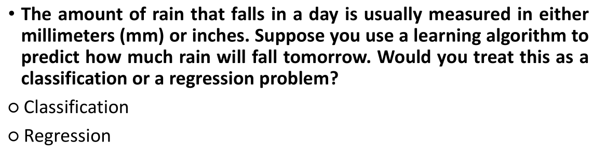
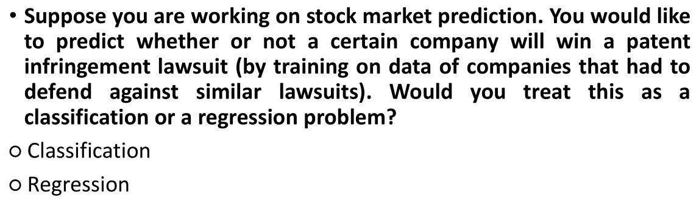
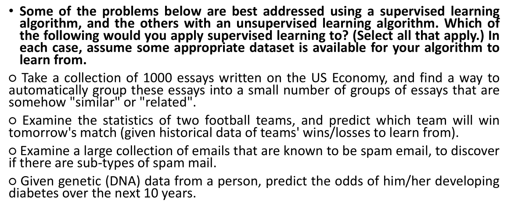
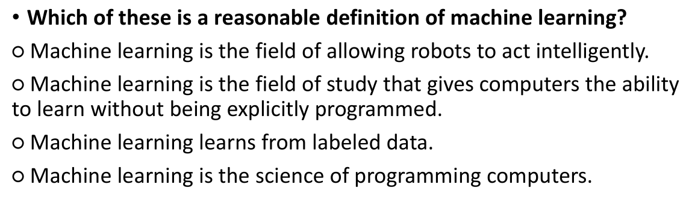

# Example questions (in lecture note)
## W1: Introduction
___

Answer: 1
___

Answer: 3
___

Answer: 2 & 3
___

Answer: 1
___

Ans: 2
___

Ans: 1
___

Ans: 2 & 4
___

Ans: 2
___
## W2: Linear regression with one variable

## W3: Linear regression with multiple variables

## W4: Classification Problems Logistic Regression

## W5: Overfitting and Regularization

## W6: ?

## W7: Neural Networks Representation

## W8: Neural Networks in Practice

